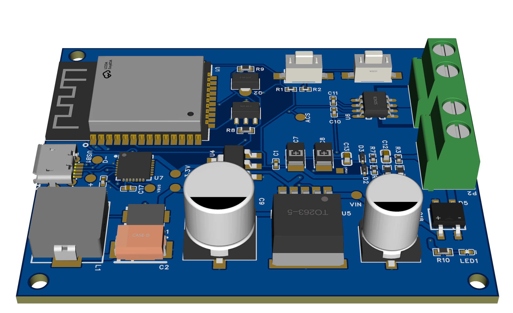

# IoT Power Monitoring Device — ESP32



> **Purpose:** Measure AC **voltage (Vrms)** using an AC–AC transformer + divider, **current (Irms)** using an **ACS712**, estimate apparent **power (V × I)** on-board, and publish metrics to MQTT over Wi‑Fi (ESP32).

---

## 1) Hardware Overview

- **MCU:** ESP32‑WROOM‑32 module. BOOT and RESET buttons are provided for flashing and reset.  
  *Schematic refs:* U1 (ESP32‑WROOM‑32‑N4), SW1 **BOOT_BUTTON** on IO0, SW2 **RESET_BUTTON** on EN.
- **Programming/USB:** **CP2102** USB‑to‑UART bridge and Micro‑USB connector.  
  *Schematic refs:* U7 **CP2102‑GM**, USB1 **Micro‑USB**.
- **Power:** Buck **LM2596‑5V** from VIN, then **AMS1117‑3.3V** LDO to the ESP32 3V3 rail.  
  *Schematic refs:* U5 **LM2596SX‑5.0**, U4 **AMS1117‑3.3**.
- **Current sensing:** **ACS712 5A** (U6) with C10/C11 filtering. ESP32 ADC reads the sensor output.  
- **Voltage sensing:** AC‑AC transformer → full-bridge (**MB10F**) → filtered **VIN_F** node; passive divider **R3 (100k) / R4 (10k)** with RC filter **R5/C13** into ADC (IO34).

> TIP: Keep mains on the high‑voltage side isolated; only the transformer secondary and downstream circuitry connect to the PCB/ESP32.


## 2) Firmware Layout

- **`main.cpp`** — Samples ADC (voltage), computes RMS per window, reads ACS712 (current), calculates power, and publishes JSON via MQTT.
- **`secrets.h`** — Your Wi‑Fi + MQTT credentials and topics (not committed).

### Expected JSON payload
The firmware publishes a compact JSON object:
```json
{
  "voltage": <float>,   // volts (Vrms)
  "current": <float>,   // milliamps (Irms)
  "power":   <float>    // watts (approx V * I)
}
```
> Keys are exactly `"voltage"`, `"current"`, `"power"`.


## 3) Cloud / MQTT (Test Broker)

You can use any public test broker for quick trials. Two common options:
- **Non‑TLS:** `test.mosquitto.org:1883`
- **TLS:** `test.mosquitto.org:8883` (the firmware currently calls `setInsecure()`, so it skips CA validation during development).

> In production, replace `setInsecure()` with a CA certificate and use a private broker/topic namespace.


### Sample `secrets.h`
Create a file named **`secrets.h`** in the sketch folder:
```cpp
#pragma once

// Wi‑Fi
static const char* ssid          = "YOUR_WIFI_SSID";
static const char* password      = "YOUR_WIFI_PASSWORD";

// MQTT
static const char* mqtt_server   = "test.mosquitto.org"; // change to your broker
static const int   mqtt_port     = 8883;                 // 1883 (non‑TLS) or 8883 (TLS)
static const char* mqtt_user     = "";                   // optional
static const char* mqtt_pass     = "";                   // optional

// Topics
// Tip: Use your device MAC/ID to make topics unique.
static const char* publishTopic  = "devices/esp32-power/metrics";
static const char* subscribeTopic= "devices/esp32-power/cmd";
```


## 4) How to Flash the Firmware

### A. With **Arduino IDE**
1. **Install Boards & Libraries**
   - Boards Manager → **ESP32 by Espressif Systems**.
   - Libraries: **PubSubClient**, **ArduinoJson**, and your **ACS712** library.
2. **Select Board & Port**
   - Board: *ESP32 Dev Module*.
   - Port: the **CP2102** COM port (install Silicon Labs CP210x driver if needed).
3. **Enter Download Mode (only if auto‑boot doesn’t trigger)**
   - Hold **BOOT**, then release **BOOT**.
4. **Upload**
   - Sketch → Upload.
5. **Open Serial Monitor @ 115200** to see logs (`Meter: V=... I=... P=...`).

### B. With **PlatformIO (VS Code)**
1. Install the **PlatformIO** extension.
2. Create / open a project for **ESP32 Dev Module**; copy in `main.cpp` and `secrets.h`.
3. In `platformio.ini`, set an appropriate upload speed and monitor speed (115200).
4. Click **Build** then **Upload**. If needed, use the manual BOOT/RESET sequence above.


## 5) Runtime & Calibration Notes

- **Sampling:** The code samples at 2 kHz and computes RMS over a 1000‑sample window (~0.5 s at 50 Hz).  
- **Current zero‑offset:** Adjust `g_current_cal_mA_offset` until a no‑load system reads ≈0 mA.  
- **Deadband:** `g_current_deadband_mA` suppresses small noise around zero.  
- **Power formula:** `P ≈ V × I` (no phase compensation). For true real power, sample v(t) & i(t) synchronously and average `v*i`.
- **Safety:** Treat mains wiring with extreme caution. Only the transformer secondary should interface with this PCB.


## 6) Quick Test

1. Power the board (via VIN or USB) and join Wi‑Fi.  
2. Confirm serial logs print lines like:  
   ```
   Voltage: 227.8 V, Current: 250 mA, Power: 56.95 W
   ```
3. Confirm publish to cloud via serial:  
   ```
   Published: {"voltage":227.8,"current":250,"power":56.95}
   ```
4. You should receive JSON payloads every ~5 seconds.


## 7) Folder Hints

```
/ (project root)
├── main.cpp
├── secrets.h            ← create this (not committed)
├── IOT POWER MONITORING DEVICE.pdf
├── Gerbers/
└── README.md
```

---

### Licenses & Credits
- Microcontroller core, libraries, and footprints belong to their respective owners.
- Hardware/firmware in this repository are provided “as‑is” for educational use.
